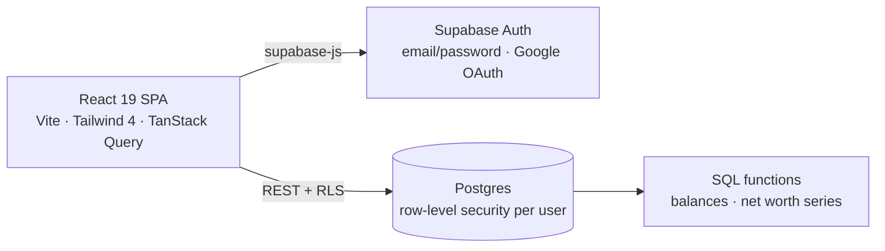

<div align="center">

# 💰 Finance Tracker

**A deploy-it-yourself personal finance app for expenses, income, recurring transactions, and net worth.**

[](https://github.com/montanarograziano/finance-tracker/actions/workflows/ci.yml)


[](LICENSE)

_Dark theme by default · English and Italian · Mobile-friendly_

</div>

---

## Why

Many finance apps require bank credentials, subscriptions, or a vendor-controlled data store. Finance Tracker lets you deploy the frontend and connect it to your own Supabase project. It can run within the free tiers for modest personal use, subject to each provider's current limits.

## Features

- 📊 **Dashboard** — net worth trend, category spending, income versus expenses, and transaction drill-down
- 💸 **Transactions** — expenses, income, and transfers with period, account, category, text, and tag filters
- 🔁 **Recurring rules** — monthly or yearly entries with skip and modify exceptions
- 🏦 **Accounts and categories** — checking, cash, investments, nested categories, colors, and icons
- 📥 **Spreadsheet import** — `.xlsx`/`.csv` preview with row validation, duplicate detection, and optional account/category creation
- 📤 **Data export** — CSV, Excel, and PDF reports plus a multi-sheet account data export
- 🔮 **Simulation** — model hypothetical expenses or income against projected net worth
- 🌍 **Internationalization** — English and Italian at runtime
- 🌗 **Light, dark, and system themes** with a privacy toggle that obscures monetary values on screen
- 🔐 **Authentication** — email/password or Google sign-in; Postgres row-level security isolates every user's records

## Architecture

The React SPA talks directly to Supabase. Postgres row-level security and ownership-preserving foreign keys form the authorization boundary; there is no custom application server.



Domain calculations live in pure TypeScript modules. Server-derived balances and net-worth history avoid downloading the full transaction history for routine dashboard reads.

## Privacy and security model

- Financial records are stored in the Supabase project configured by the deployer; this is not the same as keeping all data on the user's device.
- The `VITE_SUPABASE_ANON_KEY` is included in the browser bundle by design. Never use a Supabase service-role key in a `VITE_*` variable.
- Every financial table has owner-scoped RLS. Composite foreign keys also prevent a record from referencing another user's account, category, or recurring rule.
- Private query caches are recreated when the authenticated user changes, preventing data from one session appearing in another.
- Spreadsheet exports neutralize formula injection. GitHub Pages serves no custom response headers, so RLS on Postgres, not HTTP headers, is the authorization boundary; `index.html` sets a `frame-ancestors 'none'` CSP `<meta>` tag, the one clickjacking mitigation a static host allows.
- The app includes no analytics or remote font request.

See [SECURITY.md](SECURITY.md) for vulnerability reporting.

## Getting started

**Prerequisites:** Node 22+, a [Supabase](https://supabase.com) account, and the [Supabase CLI](https://supabase.com/docs/guides/cli).

```bash
git clone https://github.com/montanarograziano/finance-tracker.git
cd finance-tracker
npm ci
cp .env.example .env.local
```

Fill in the public project values from **Supabase Dashboard → Project Settings → API**:

```dotenv
VITE_SUPABASE_URL=https://your-project-ref.supabase.co
VITE_SUPABASE_ANON_KEY=your-anon-key
VITE_TURNSTILE_SITE_KEY=your-turnstile-site-key
```

Apply the schema and start the app:

```bash
npx supabase link --project-ref <your-project-ref>
npx supabase db push
npm run dev
```

### Configure authentication

In the Supabase dashboard:

1. Enable Email and, optionally, Google under **Authentication → Sign In / Providers**.
2. Set the deployed site URL and allowed redirects under **Authentication → URL Configuration**. Add `http://localhost:5173` for local development.
3. For an internet-facing deployment, configure Turnstile CAPTCHA, review auth rate limits and password requirements, and decide whether email confirmation fits your audience. For a private personal instance, disable public signup instead.

The committed `supabase/config.toml` configures local development; do not treat its auth defaults as production recommendations.

### Import existing data

Export CSV from the Report page to obtain the expected columns:

```text
date,type,amount,account,to_account,category,description,notes,tags
```

Shape your data the same way and use **Import** on the Transactions page. The preview reports invalid and duplicate rows before writing anything.

## Scripts

| Command                | Purpose                        |
| ---------------------- | ------------------------------ |
| `npm run dev`          | dev server on `localhost:5173` |
| `npm test`             | run the Vitest suite           |
| `npm run typecheck`    | TypeScript project check       |
| `npm run lint`         | ESLint                         |
| `npm run format:check` | verify Prettier formatting     |
| `npm run build`        | production build in `dist/`    |

## Project structure

```text
src/
├── auth/        # sessions, routes, and login/register flows
├── components/  # forms, layout, import preview, and shared UI
├── data/        # Supabase queries and TanStack Query hooks
├── domain/      # pure finance, recurrence, import, and simulation logic
├── export/      # CSV, XLSX, and PDF generation
├── i18n/        # English and Italian translations
├── lib/         # Supabase client, theming, privacy, and money formatting
└── pages/       # route-level components
supabase/
└── migrations/  # schema, constraints, RLS policies, and SQL functions
```

The repository currently has 180+ tests, with the densest coverage around pure domain logic and security-sensitive authentication and export behavior.

## Deploying

`.github/workflows/pages.yml` builds and deploys the SPA to GitHub Pages on every push to `main`, GitHub Pages is this repo's only deployment. `actions/configure-pages` supplies the base path (`/finance-tracker/` for this repo) and the workflow passes it to `vite build --base`, so the built assets and routes resolve correctly under that subpath. The app uses `HashRouter` (not `BrowserRouter`) because Pages has no SPA catch-all rewrite: hash routes (`#/accounts`, `#/categories`, ...) never hit the server on refresh or direct navigation, so no 404 is possible.

Live at <https://montanarograziano.github.io/finance-tracker/>.

1. Set the three `VITE_*` values from `.env.example` as repository variables/secrets consumed at build time (Pages has no runtime env, only what's baked into the bundle at build).
2. Add `https://montanarograziano.github.io/finance-tracker/` to Supabase's **Authentication → URL Configuration** Site URL and Redirect URLs allowlist, alongside `http://localhost:5173`.
3. Add `montanarograziano.github.io` to Cloudflare Turnstile's allowed domains for the site key in use.
4. Apply the production auth controls listed above.

## Contributing

Issues and focused pull requests are welcome. Run the same checks as CI before submitting:

```bash
npm run typecheck && npm run lint && npm run format:check && npm test && npm run build
```

## License

[MIT](LICENSE)
